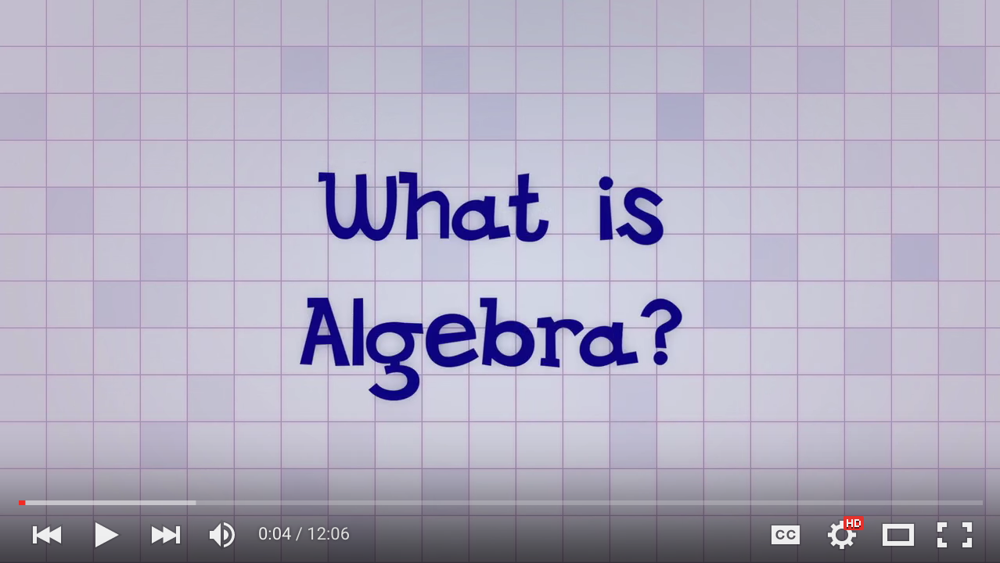

#### [⇐ Previous](html_css.md) | [Next ⇒](javascript.md)

## Algebra Basics

**Duration:** About 2 hours

**Algebra** is the study of using variables to represent unknown values in a mathematical equation. Engineers, scientists, economists, and, of course, web developers use algebra to model the physical world and answer questions like:

- What's the ideal curvature of a trumpet bell?
- How much force does it take to throw a ball 50 meters?
- When's the best day of the week to travel from San Francisco to Seattle?
- How long will it take a social network to gain 100,000 active users?

In this chapter, your objective is to demonstrate competency with the basics of algebra. To complete this objective, please follow along with the videos found below and complete the self-assessment at the end of this chapter. If you're already familiar with algebra, you may be able to complete the self-assessment without watching the video. Though, you may also learn a trick or two from it.

[Math Antics - Algebra Basics][math-antics]

[][math-antics]

### Self-assessment

Take a moment to think about how you would answer the following questions. Then write down the questions and your answers in a notebook. When you're done, check your answers against our [solutions](solutions/algebra.md) and see how you fared.

### What is Algebra?

- What are the four main operations of algebra?
- What new element does algebra introduce to arithmetic?
- How might you write the arithmetic `4 + 5 = _` in algebra?
- What is an algebraic equation?
- What does it mean to solve an algebraic equation?
- Solve the equation `4 + 5 = x`.
- Solve the equation `x - 5 = 4`.
- True or false: Variables like `x` can stand for different values in different equations.
- True or false: Variables like `x` can stand for different values in same equation.
- True or false: Variables like `x` and `y` can stand for same values in same equation.
- What are letters that have varying or changes values called?
- Which operation does a fraction represent?
- What is the default operation in algebra?
- True or false: `ab` is the shorthand form of `a × b`.
- True or false: `4b` is the shorthand form of `4 × b`.
- True or false: `45` is the shorthand form of `4 × 5`.
- True or false: `(4)(5)` is the shorthand form of `4 × 5`.
- True or false: `(4)5` is the shorthand form of `4 × 5`.

### Solving Basic Equations Part 1

- What's the key strategy for solving an equation with an unknown value?
- Why is an equation like balance scale?
- Solve the equation `x + 8 = 14`.
- How do you check your answer after you've solved an equation?
- True or false: Addition has the commutative property.
- Solve the equation `37 = 21 + x`.
- Solve the equation `x - 3 = 16`.
- Solve the equation `5 = x - 37`.
- True or false: Subtraction has the commutative property.
- Solve the equation `9 - x = 7`.

### Solving Basic Equations Part 2

- True or false: Addition and subtraction are inverse operations.
- True or false: Multiplication and division are inverse operations.
- True or false: Multiplication has the commutative property.
- Solve the equation `4x = 20`.
- Solve the equation `8x = 120`.
- True or false. `3 = 3 ÷ 1`.
- Solve the equation `x ÷ 2 = 5`.
- Solve the equation `x ÷ 4 = 16`.
- True or false: Division has the commutative property.
- Solve the equation `9 ÷ x = 3`.

### Solving 2-Step Equations

- How do you decide which order to undo operations in a multi-step equation?
- What are the reverse order of operation rules?
- Solve the equation `5x + 3 = 18`.
- Solve the equation `x ÷ 4 - 3 = 5`.
- Solve the equation `4(x + 1) = 8`.
- True or false: The fraction line is used to automatically group things that are above it and below it.
- Solve the equation `(x - 3) ÷ 4 = 5`.

### Exponents In Algebra

- What is `x⁰` equivalent to?
- What is `x¹` equivalent to?
- What is `x²` equivalent to?
- Solve the equation `√x = 4`.
- Solve the equation `³√x = 2`.
- Solve the equation `x² = 25`.
- Solve the equation `x³ = 216`.

### What Are Polynomials?

- What's a term?
- What's a coefficient?
- True or false. The variable part of a term can be one or more variables raised to a power.
- What's a polynomial?
- What's a monomial?
- What's a binomial?
- What's a trinomial?
- How many terms does the polynomial `4x² + x + 2` have?
- What is a constant term?
- True or false. The degree of a term is determined by the power of the variable part.
- True or false. `4x²` is a second degree term.
- True or false. `x` is a first degree term.
- Why do we care about the degree of terms?
- Arrange the polynomial `3x³ + 4 + 2x + 6x² + 5x⁴` from highest to lowest degree.
- Arrange the polynomial `2x + 4x³ - 2x⁶` from highest to lowest degree.

### Simplifying Polynomials

- How do you simply a polynomial?
- Simplify the polynomial `x³ + x² + x² + x¹`.
- What are like terms?
- True or false: `3x²` and `x²` are like terms.
- True or false: `x³` and `y³` are like terms.
- True or false: `-5x` and `4x` are like terms.
- Simplify the polynomial `-5x + 4x`.
- True or false: `2x²` and `2x³` are like terms.
- True or false: `-3xy` and `6yx` are like terms.
- Simplify the polynomial `-3xy + 6yx`.
- True or false: `5x²y` and `3yx²` are like terms.
- Simplify the polynomial `2x³ + 3x - x³ + 5`.
- Simplify the polynomial `4x² - 5 + x² + 11`.
- Simplify the polynomial `-x + 1 - 7x² + 3x - 6 - 2x²`.

### Conclusion

Congratulations! By completing the self-assessment, you've demonstrated a high degree of discipline and competency with the basics of algebra. You're ready to start building a dynamic website.

#### [⇐ Previous](html_css.md) | [Next ⇒](javascript.md)

[math-antics]: https://www.youtube.com/watch?v=NybHckSEQBI&index=1&list=PLUPEBWbAHUszT_GebJK23JHdd_Bss1N-G
