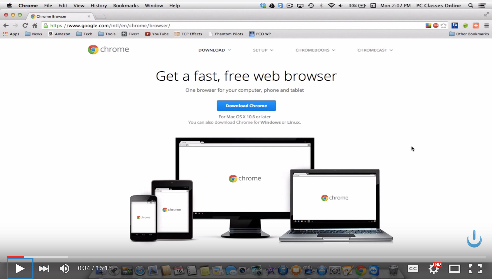

#### [⇐ Previous](shortcuts.md) | [Next ⇒](typing.md)

## Google Chrome

**Duration:** About 30 minutes

[Google Chrome][google-chrome] is a web browser that's fast and secure. Though web developers use every browser to test their creations, many choose Chrome as their primary one. It has a minimalistic user interface, supports the latest web standards, has great built-in developer tools, and is customizable with extensions.

In this chapter, your objective is to demonstrate competency with Google Chrome. To complete this objective, please follow along with the video found below and complete the self-assessment at the end of this chapter. If you're already familiar with Chrome, you may be able to complete the self-assessment without watching the video. Though, you may also learn a trick or two from it.

If you've ordered a laptop through us, please coordinate with your campus on the earliest date it's available for pickup. Also, you may want to re-watch this video once you obtain it.

[Intro to Google Chrome][intro-to-chrome]

[][intro-to-chrome]

### Self-assessment

Take a moment to think about how you would answer the following questions. Then write down the questions and your answers in a notebook. When you're done, check your answers against our [solutions](solutions/chrome.md) and see how you fared.

- How do you install Chrome?
- What two things can the address bar do?
- What's the keyboard shortcut for reloading a page?
- What's the keyboard shortcut for creating a bookmark?
- Where is the bookmark bar located on the window?
- How do you add a folder to the bookmark bar?
- How do you delete an item from the bookmark bar?
- What's the keyboard shortcut for opening the preferences (i.e. settings)?
- What's the keyboard shortcut for opening a new tab?
- What's the keyboard shortcut for opening a new window?
- What's the difference between an extension and an app?

### Conclusion

Congratulations! By completing the self-assessment, you've demonstrated a high degree of discipline and competency with Google Chrome. You're making great progress.

#### [⇐ Previous](shortcuts.md) | [Next ⇒](typing.md)

[google-chrome]: https://www.google.com/chrome/browser/desktop/
[intro-to-chrome]: https://www.youtube.com/watch?v=XphOoqHzTC0&t=15
