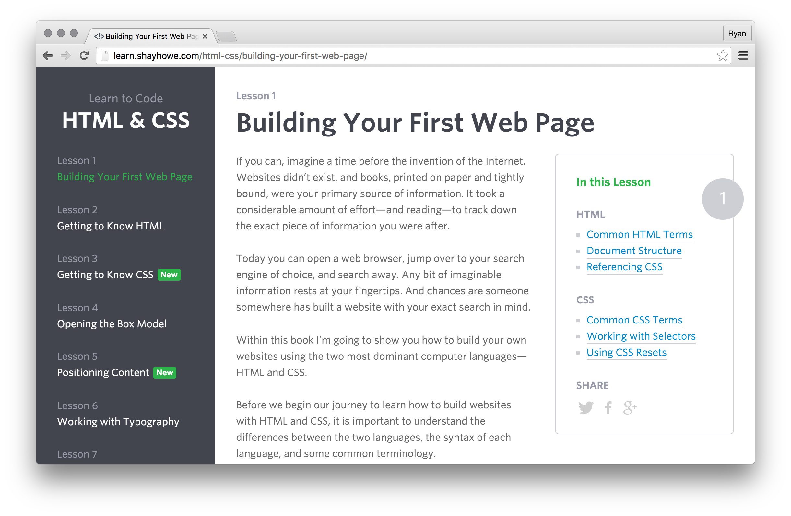
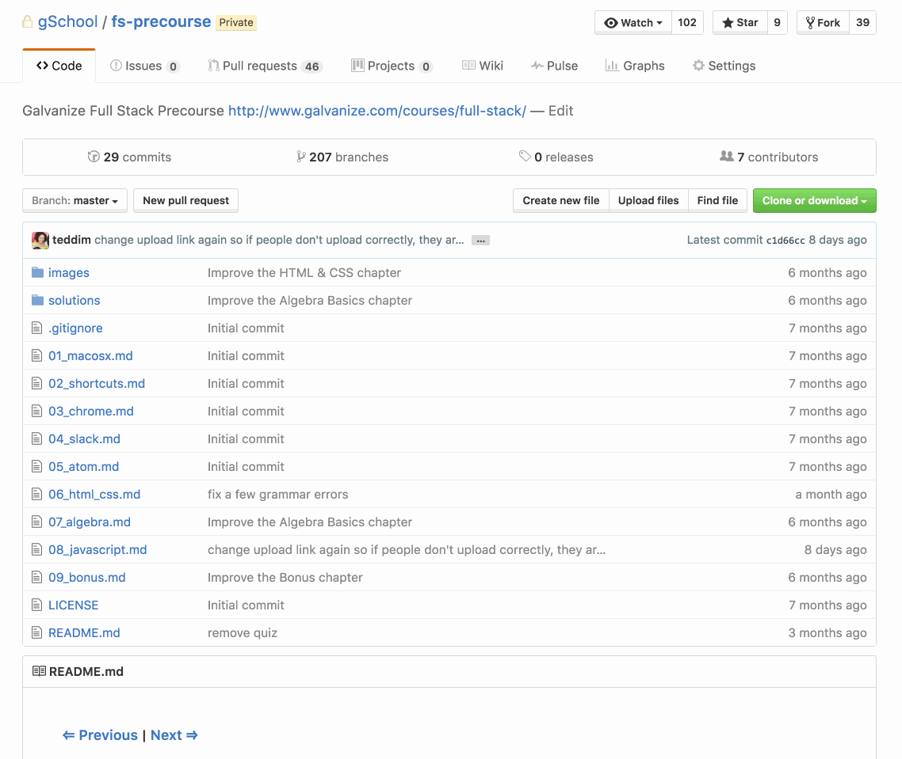

#### [⇐ Previous](atom.md) | [Next ⇒](algebra.md)

## HTML & CSS

**Duration:** About 20 hours

Hyper Text Markup Language, or **HTML**, is a language for describing the structure and content of a web page with syntax like `
Hello world
`. And Cascading Style Sheets, or **CSS**, is a language for describing the style of a web page with syntax like `p { color: orange; }`. Together, they are two essential technologies for web development. When mastered, web developers tend to prefer writing HTML and CSS code by hand over using tools like Adobe Dreamweaver because it gives them complete control over how web pages are structured and styled.

In this chapter, your objective is to demonstrate competency with HTML and CSS. To complete this objective, please follow along with the tutorial found below and complete the assessment at the end of this chapter. If you're already familiar with HTML and CSS, you may be able to complete the assessment without reading the tutorial. Though, you may also learn a trick or two from it.

As you read through the tutorial, type out every code sample by hand that you come across. Then try to run the code in a web browser like Google Chrome. Only copy-and-paste code as a last resort if you can't get it to work correctly.

[Learn to Code HTML & CSS][learn-html-css]

[][learn-html-css]

### Assessment

Your task is to use HTML and CSS to build a personal website for yourself. You'll find some guidelines below on the how to approach the project. If time permits, you'll have an opportunity to present your website to your peers during the course. Think of it as a fun and creative way of getting to know one another.

When you're finished, we'd like to take a look at your work. Please use the following steps to submit your website.

1. Scroll to the top of this page and click `Fork`.
	* You may need to click your username to create the `Fork` on your account.
	* `Forking` is a github concept that allows you to make an exact copy of a repository on your own account.

1. On your `Fork` of this repo on GitHub, (Make sure your name is in the top left of the page.) click the **Upload Files** button

1. Drag and drop the folder you'd like to upload.

1. Type a short commit message. (e.g. personal website)

1. Click the **Commit changes** button.
	* This will upload your files to your copy of the repo on github

1. After uploading, click **New pull request** (Make sure your name is in the top left of the page.)

1. On the pull request page, click **Create pull request** and then after the page loads, click  **Create pull request** again
	* This will allow the galvanize instructors to see your uploaded files

#### Scope and Content

Your personal website should have two pages linked together with anchor tags.

On the first page, describe who you are and where you come from. Tell us about yourself, your hobbies, hometown, family, friends, etc. For example:

> Hi there! My name is Zelda. I was born into royalty and spend my nights and weekends battling evil. My closest friend is Link. Together, we protect the kingdom of Hyrule. Here's a picture of us fighting Ganon. [INSERT PHOTO]

On the second page, describe where you're going in life and who you'll become. Tell us about your career goals, education goals, hopes, dreams, etc. For example:

> I'm excited to start Galvanize and learn about web development technologies like HTML, CSS, and JavaScript. I enrolled in the web development immersive because I've always been fascinated by the web's ability to bring people together. After Galvanize, I would love to work for a social network company like Snapchat or OKCupid.

Oh, and somewhere on your website, include an animated GIF that illustrates how you feel about starting your new career. For example:

#### Structure and Style

You're free to structure and style your website in any way you please. Though it may feel intimidating, this is your chance to show us who you are.

When it comes to structure, it's a good idea to use semantic tags for your content. In other words,

- If you have content that's a primary heading, use an `<h1>` tag.
- If you have content that's a secondary heading, use an `<h2>` tag.
- If you have content that's an ordered list, use an `<ol>` tag.
- If you have content that's an unordered list, use an `<ul>` tag.
- If you have content that's tabular, use a `<table>` tag.
- If you have content that's belongs in the same section, use a `<section>` tag.
- If you have content that's belongs in the same navigation, use a `<nav>` tag.
- And so on.

When it comes to style, take this opportunity to present your personality to us visually. In other words,

- Capture our attention with typographic properties like `font`, `line-height`, and `text-align`.
- Arrange your content with layout properties like `display`, `position`, `left`, `top`, `float`, and `clear`.
- Size your content with dimensional properties like `height`, `width`, `padding`, `border`, and `margin`.
- Spice up to your content with coloration properties like `color`, `background-color`, and `background-image`.
- And so on.

You're free to get as fancy as you want, but don't feel like you have to go overboard. You're also free to add interactivity with JavaScript, but it's not a requirement for this assessment. As you work, keep an eye on how much time has elapsed. There are a few more chapters in this precourse, like one dedicated to JavaScript, that are equally important.

#### Valid Syntax

To help you write correct code, we recommend you use a **syntax validator**—a tool that'll list out all the syntax warnings and errors in your code. It's okay if your code has syntax warnings, but you'll want to fix any syntax errors before you submit your website. The syntax validators check one file at a time, so remember to validate each HTML and CSS file.

- [HTML Validator](https://validator.w3.org/#validate_by_upload)
- [CSS Validator](https://jigsaw.w3.org/css-validator/#validate_by_upload)

### Conclusion

Congratulations! By completing the assessment, you've demonstrated a high degree of discipline and competency with HTML and CSS. Take a moment to congratulate yourself for all of your hard work. :)

#### [⇐ Previous](atom.md) | [Next ⇒](algebra.md)

[learn-html-css]: http://learn.shayhowe.com/html-css/building-your-first-web-page/
[upload]: https://github.com/gSchool/fs-precourse/upload/personal
