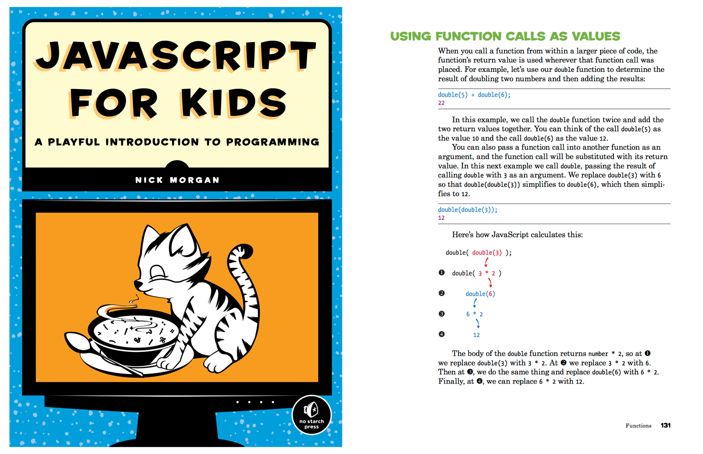
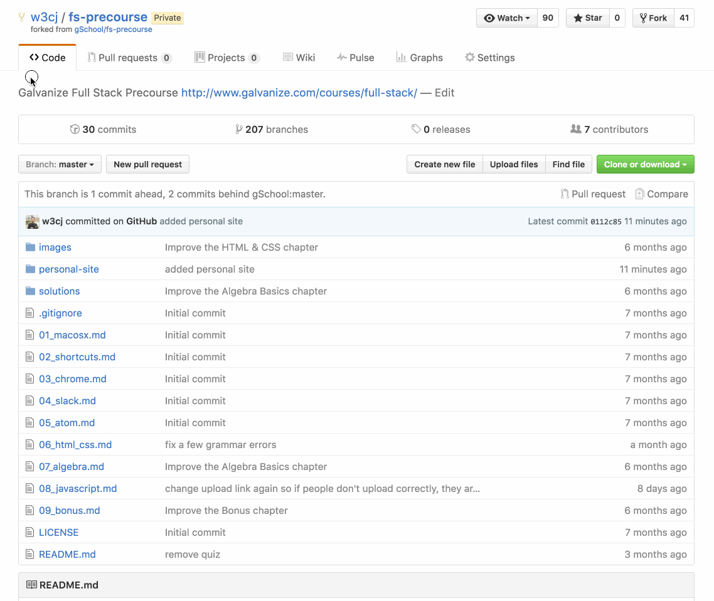

#### [⇐ Previous](algebra.md) | [Next ⇒](studying_learning.md)

## JavaScript

**Duration:** About 15 hours

**JavaScript** is a high-level, dynamic, untyped, and interpreted programming language that's primarily used to change how a website looks and behaves when a user interacts with it. For this reason, JavaScript is an essential technology for web developers and, therefore, the central focus of our in-person training.

In this chapter, your objective is to demonstrate familiarity with JavaScript. To complete this objective, please read the book **JavaScript for Kids** through chapter 8 and then complete the assessment at the end of this chapter. While the title may suggest otherwise, this book is for anyone who wants to learn JavaScript for the first time. It's designed to be kid friendly, but it can serve as a programming book for beginners of all ages. In the spirit of the "For Dummies" and the "Idiot's Guide" series, JavaScript for Kids approaches the topic of writing JavaScript as if the reader has little to no background in it.

You can pick up JavaScript for Kids from a number of bookstores, though you'll receive a **40% discount** by using the `JAVASCRIPTKIDS40` coupon code when purchasing directly through No Starch Press.

As you read each chapter, type out and run all the code examples you find. Though it may take you longer to complete each chapter, you'll retain so much more of the information. That's because reading code and writing code are two very different skills that both require practice. Once you reach the end of a chapter, complete all of the programming challenges. Most of them will ask you to extend the programs you built along the way.

[JavaScript for Kids][javascript-kids]

[][javascript-kids]

### Assessment

In chapter 8 of JavaScript for Kids, there's a programming challenge that asks you to write a hangman game using JavaScript functions. Your task is to use the code provided by the author on page 139 and 140 as a blueprint to create such a game.

Start off by creating a `hangman.html` file and embed the author's blueprint code inside a `<script>` tag. Once the structure is in place, write the code for the following functions.

- `pickWord`
- `setupAnswerArray`
- `showPlayerProgress`
- `getGuess`
- `updateGameState`
- `showAnswerAndCongratulatePlayer`

Run the program often to make sure everything works as you expect. When you're finished, we'd like to take a look at your work. Please use the following steps to submit your game.

1. On GitHub, navigate to your fork of this repo (which you created in Section 6 HTML/CSS).
	* Your fork will have the URL with your username in it:
	`https://github.com/your_username_here/fs-precourse`

1. Click **Upload files**

1. Drag and drop the `hangman.html` file onto the file tree.

1. Type a short commit message. (e.g. added hangman)

1. Click the **Commit changes** button

### Conclusion

Congratulations! By completing the assessment, you've demonstrated a high degree of discipline and familiarity with JavaScript. Take a moment to congratulate yourself for all of your hard work. :)

#### [⇐ Previous](algebra.md) | [Next ⇒](studying_learning.md)

[javascript-kids]: https://www.nostarch.com/jsforkids
[upload]: https://github.com/gSchool/fs-precourse/upload/hangman/
