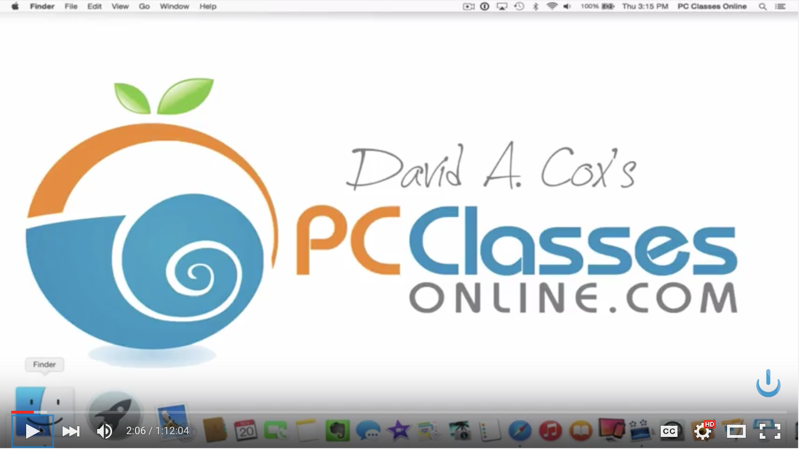

#### [⇐ README](README.md) | [Next ⇒](shortcuts.md)

## macOS

**Duration:** About 2 hours

At Galvanize, we teach web development using **macOS**, the Unix-based operating systems from Apple. While other operating systems are certainly proficient at the task of web development, we've found that macOS uniquely combines an intuitive graphical interface with a powerful command line interface. The result is a capable, integrated, and easy-to-learn operating system that's perfect for web development.

In this chapter, your objective is to demonstrate competency with macOS's graphical interface. Don't worry about the command line interface for now; you'll focus on gaining competency with that during the in-person training. To complete this objective, please follow along with the video found below and complete the self-assessment at the end of this chapter. If you're already familiar with macOS, you may be able to complete the self-assessment without watching the video. Though, you may also learn a trick or two from it.

If you've ordered a laptop through us, please coordinate with your campus on the earliest date it's available for pickup. Also, you may want to re-watch this video once you obtain it.

**TIP:** While this video demonstrates usage of an older version macOS called Yosemite, the information is not terribly outdated.

[Learn the Mac in Under 90 Minutes 2015 Yosemite Edition][learn-macos]

[][learn-macos]

### Self-assessment

Take a moment to think about how you would answer the following questions. Then write down both the questions and your answers in a notebook. When you're done, check your answers against our [solutions](solutions/macos.md) and see how you fared.

#### The Finder

1. What's the Finder?
1. Where are applications installed?
1. What's the Desktop?
1. Where are documents stored?
1. Where are downloads stored?
1. What's the Home folder?

#### The Dock

1. What's the Dock?
1. How do you add applications to the Dock?
1. How do you remove applications from the Dock?
1. How do you move applications around inside the Dock?
1. What does the dot under the application icon mean?

#### The Menu Bar

1. What's the Apple Menu?
1. What information is available when selecting "About This Mac"?
1. What does selecting "Force Quit" do?
1. What's the difference between Sleep, Restart, Shutdown, and Log Out?
1. What's the Notifications Center?
1. What's Spotlight?
1. How do you connect to Wi-Fi networks?

#### System Preferences

1. What are the System Preferences?
1. Where are the settings for showing the scroll bars?
1. Where are the settings for choosing a different Desktop background?
1. Where are the settings for allowing apps to be downloaded from the app store?
1. Where are the settings for preventing Spotlight from searching folders?
1. Where are the settings for adjusting the when the display turns off?
1. Where are the settings for gesturing with the trackpad?
1. What happens when you click the red, yellow, and green buttons at the top left of every window?
1. How do you turn off fullscreen mode?
1. Where are the settings for configuring a printer?
1. Where are the settings for enabling iCloud features?
1. Where are the settings for managing user accounts?
1. Where are the settings for downloading updates from the App Store?
1. Where are the settings for backing up your computer with Time Machine?

#### The App Store

1. What's the App Store?
1. Where can you download updates for applications and macOS itself?

### Conclusion

Congratulations! By completing the self-assessment, you've demonstrated a high degree of discipline and competency with the graphical interface of macOS. You're well on your way to becoming a professional web developer.

#### [⇐ README](README.md) | [Next ⇒](shortcuts.md)

[learn-macos]: https://www.youtube.com/watch?v=wSPisJXyjso
