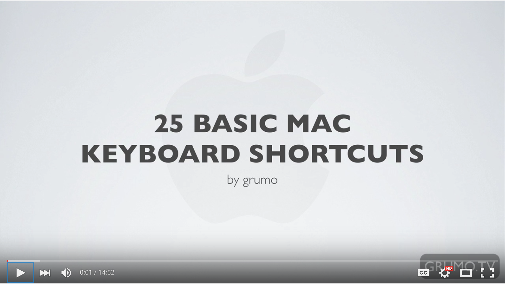

#### [⇐ Previous](macos.md) | [Next ⇒](chrome.md)

## Keyboard Shortcuts

**Duration:** About 30 minutes

A **keyboard shortcut** is a series of one or more keys that when pressed at the same time will trigger an application or operating system action. Simply put, using keyboard shortcuts instead of the trackpad or mouse will make you a more productive web developer. For example, imagine that a single keyboard shortcut could save you 3 seconds of unnecessary moving and clicking the pointer. It might not seem like much, but if performed 20 times per day, you'd save yourself 6 hours over the course of one year. And that's just one keyboard shortcut!

In this chapter, your objective is to demonstrate competency with the most common keyboard shortcuts on macOS. To complete this objective, please follow along with the video found below and complete the self-assessment at the end of this chapter. If you're already familiar with macOS keyboard shortcuts, you may be able to complete the self-assessment without watching the video. Though, you may also learn a trick or two from it.

If you've ordered a laptop through us, please coordinate with your campus on the earliest date it's available for pickup. Also, you may want to re-watch this video once you obtain it.

[25 Basic Mac Keyboard Shortcuts][keyboard-shortcuts]

[][keyboard-shortcuts]

### Self-assessment

Take a moment to think about how you would answer the following questions. Then write down the questions and your answers in a notebook. When you're done, check your answers against our [solutions](solutions/shortcuts.md) and see how you fared.

#### Universal

What's the keyboard shortcut for the following universal actions?

- Cut
- Copy
- Paste
- Select all
- Undo
- Redo
- Toggle Spotlight

#### Applications

What's the keyboard shortcut for the following application actions?

- Switch to the next application
- Switch to the next window
- Close a window
- Quit the application
- Open the preferences

#### Documents

What's the keyboard shortcut for the following document actions?

- Create a new document
- Save a document
- Open a document
- Print a document

#### Finder

What's the keyboard shortcut for the following Finder actions?

- Create a new folder
- Delete a file or folder
- Empty the trash

#### Cursor

What's the keyboard shortcut for the following cursor actions?

- Move the cursor all the way to the left
- Move the cursor all the way to the right
- Move the cursor all the way to the top
- Move the cursor all the way to the bottom

#### Screenshot

What's the keyboard shortcut for the following screenshot actions?

- Take a screenshot of the entire screen
- Take a screenshot of the custom area
- Take a screenshot of a single window

### Conclusion

Congratulations! By completing the self-assessment, you've demonstrated a high degree of discipline and competency with the most common keyboard shortcuts on macOS. Take a moment to pat yourself on the back. :)

#### [⇐ Previous](macos.md) | [Next ⇒](chrome.md)

[keyboard-shortcuts]: https://www.youtube.com/watch?v=AdMuZses96Q
