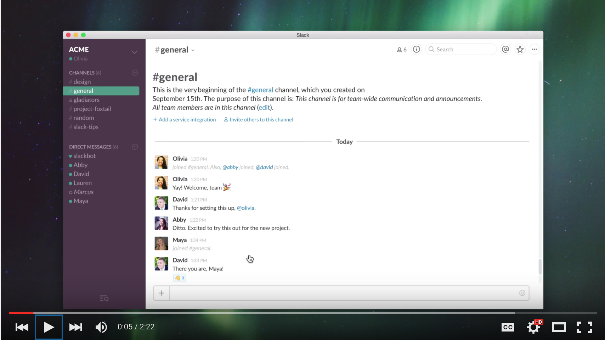

#### [⇐ Previous](typing.md) | [Next ⇒](atom.md)

## Slack

**Duration:** About 1 hour

[Slack][slack] is a messaging application for teams. It brings team communication together into one simple place. Slack is popular with web development teams because conversations are organized into topic channels and direct messages. This allows you to communicate with teammates without cluttering up your email inbox. You can even share files and code snippets making collaboration more productive, transparent, and efficient.

In this chapter, your objective is to demonstrate competency with Slack. To complete this objective, please follow along with the videos found below and complete the self-assessment at the end of this chapter. If you're already familiar with Slack, you may be able to complete the self-assessment without watching the video. Though, you may also learn a trick or two from it.

If you've ordered a laptop through us, please coordinate with your campus on the earliest date it's available for pickup. Also, you may want to re-watch this video once you obtain it.

[Slack Video Guides][slack-guides]

[][slack-guides]

### Self-assessment

Take a moment to think about how you would answer the following questions. Then write down the questions and your answers in a notebook. When you're done, check your answers against our [solutions](solutions/slack.md) and see how you fared.

Once you've checked your answers, take a moment to complete the following tasks.

1. Update your profile to include your full name and a headshot photo.
1. Introduce yourself in your cohort's channel.

#### General

- What's Slack?
- Why is Slack so useful for teams?
- How do you install the Slack application?
- What's Galvanize's Slack team URL? (Check your welcome email)

#### Channels

- What's your cohort's Slack channel? (Check your welcome email)
- How do you discover and join existing channels?
- What's the `#general` channel?
- What's a starred channel?
- How do you create a channel?
- How do you leave a channel?
- What's the benefit of using a public channel?
- What's the benefit of using a private channel?

#### Messages

- How do you message someone in a channel?
- How do you send a direct message?
- How many people can be part of a group direct message?
- How do you format some message text in bold?
- How do you format some message text as code?
- How do you add an emoji reaction to a message?

#### Notifications

- What are the ways you can receive a notification?
- What's a highlight word?
- How do you adjust the notification settings of a channel?
- How do you mute a channel?
- How do you activate Do Not Disturb mode?

#### Files

- How do you upload a file to a channel or direct message?
- What happens to a file's permissions when it's shared?

#### Search

- What type of content is searchable?
- What are search modifiers?
- What does the `from:` search modifier do?
- What does the `in:` search modifier do?
- What does starring a message or file do?

### Conclusion

Congratulations! By completing the self-assessment, you've demonstrated a high degree of discipline and competency with Slack. Remember, everyone needs help from time to time. If you're feeling stuck, help is only a Slack message away.

#### [⇐ Previous](typing.md) | [Next ⇒](atom.md)

[slack]: https://slack.com/
[slack-guides]: https://www.youtube.com/watch?v=9RJZMSsH7-g&list=PLWlXaxtQ7fUb1WqLJDqJFGQsAXU7CjoGz
